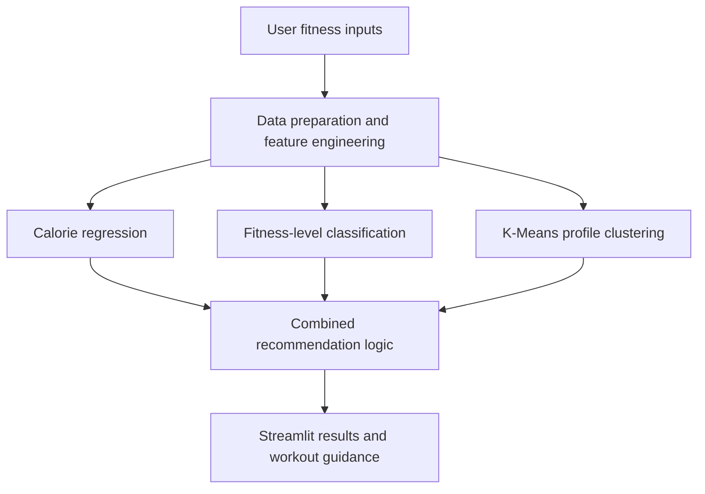

# Smart-Fitness-Recommendation-System


Smart-Fitness-Recommendation-System is an end-to-end machine learning project that transforms workout and body-related data into understandable fitness insights and general workout recommendations. The project combines data cleaning, feature engineering, exploratory analysis, regression, classification, clustering, rule-based recommendations, and a Streamlit web application.
This project was developed as a assignment for the Data Wrangling and Machine Learning course within the Graduate Diploma in Information Sciences at Massey University. It demonstrates the practical application of data preparation, machine learning, model evaluation and Streamlit application development.


> **Important:** This is an educational prototype. Its outputs are general fitness guidance only and must not be treated as medical advice, a clinical diagnosis, or a substitute for guidance from a qualified health professional.

## Project overview

Fitness trackers collect information such as heart rate, workout duration, activity frequency, and calories burned, but raw measurements can be difficult to interpret. This project explores how those measurements can be converted into practical, user-friendly outputs.

[View Notebook](Smart_Fitness_Recommendation_System.ipynb) |
[View Streamlit App](streamlit_app.py)


The system can:

- estimate calories burned during a workout;
- classify users into project-defined fitness levels;
- engineer BMI, activity, heart-rate, intensity, and fitness-score features;
- group users into broader fitness profiles with K-Means clustering; and
- generate general workout recommendations based on model outputs and safety-oriented rules.

## How the system works



The Streamlit application trains the project models from the included dataset when it starts. It then applies the same feature-engineering and recommendation logic to information entered by the user.

## Dataset

The included fitness dataset contains **1,800 records** and **15 original columns** covering:

- age and gender;
- height, weight, BMI, and body-fat percentage;
- maximum, average, and resting heart rate;
- workout type, duration, and weekly frequency;
- calories burned;
- daily water intake; and
- experience level.

The application supports four workout categories: **Strength, Cardio, Yoga, and HIIT**.

### Engineered features

The analysis creates additional features to make the raw data more useful:

| Feature | Description |
|---|---|
| `BMI_Corrected` | BMI recalculated from height and weight |
| `BMI_Category` | Underweight, Normal, Overweight, or Obese |
| `Session_Minutes` | Workout duration converted from hours to minutes |
| `Weekly_Workout_Minutes` | Session duration multiplied by weekly workout frequency |
| `Activity_Level` | Low, Moderate, or High weekly activity |
| `Age_Group` | Broader age category used by the recommendation rules |
| `BPM_Increase` | Difference between average workout and resting heart rate |
| `MET` | Estimated workout-intensity value mapped from workout type |
| `Fitness_Score_100` | Project-defined fitness score normalised to a 0–100 scale |
| `Fitness_Level` | Low, Moderate, or High Fitness based on the engineered score |

## Modelling approach and results

| Component | Methods | Main result | Interpretation |
|---|---|---|---|
| Calories burned prediction | Linear Regression, KNN, Decision Tree, and Random Forest regression | Linear Regression performed best: MAE ≈ 254 calories, RMSE ≈ 317 calories, and R² ≈ 0.0028 | The available features explain almost none of the variation in calories burned, so this output should be treated as a rough experimental estimate |
| Fitness-level classification | Logistic Regression, KNN, Decision Tree, Random Forest, and Gradient Boosting | Gradient Boosting achieved approximately 95% accuracy and 0.946 weighted F1 | Overall performance is high, but the engineered target is severely imbalanced and is not a clinical fitness label |
| Fitness-profile clustering | StandardScaler, K-Means, silhouette analysis, and PCA visualisation | `k = 2` produced the strongest mathematical separation; `k = 3` was selected for more interpretable profiles | The clusters overlap and should be treated as broad recommendation profiles rather than distinct natural groups |
| Workout recommendation | Rule-based logic | Produces workout type, intensity, frequency, duration, and a safety note | Recommendations combine predicted level, cluster profile, BMI category, activity level, and age group |

The three user-facing cluster labels are:

1. **Beginner / Low Activity Profile**
2. **Moderate Fitness Profile**
3. **High Activity / Advanced Profile**

## Streamlit application

### User inputs

- Age and gender
- Height and weight
- Workout type
- Session duration and weekly frequency
- Average and resting heart rate
- Body-fat percentage
- Daily water intake
- Experience level
- Fitness goal

### Application outputs

- BMI and BMI category
- Weekly activity level
- MET intensity value
- Estimated calories burned
- Predicted fitness level
- K-Means fitness profile
- Recommended workout and intensity
- Suggested weekly frequency and session duration
- General safety note

The selected fitness goal is currently displayed as context. It does not yet change the executable recommendation rules.

## Technology stack

- **Python**
- **pandas** and **NumPy** for data preparation
- **Matplotlib** and **Seaborn** for exploratory visualisation in the notebook
- **scikit-learn** for preprocessing and machine learning
- **Streamlit** for the interactive application
- **Jupyter Notebook** for analysis and model development

## Repository structure

Use the following filenames when adding the project to GitHub. The application expects the dataset to be named exactly `Fitness Tracker Dataset.csv` and stored in the same directory as the app.

```text
Smart-Fitness-Recommendation-System/
├── streamlit_app.py
├── requirements.txt
├── Fitness Tracker Dataset.csv
└── Smart_Fitness_Recommendation_System.ipynb
```


## Installation and local use

### 1. Download or clone the repository

Open a terminal in the project directory.

### 2. Create a virtual environment

```bash
python -m venv .venv
```

Activate it on Windows:

```powershell
.venv\Scripts\activate
```

Activate it on macOS or Linux:

```bash
source .venv/bin/activate
```

### 3. Install the required packages

```bash
pip install -r requirements.txt
```

### 4. Run the Streamlit application

```bash
streamlit run streamlit_app.py
```

Streamlit will provide a local address, usually `http://localhost:8501`.

## Running the notebook

The current notebook contains a computer-specific Windows data path. Before running it on another computer, replace the dataset-loading cell with a relative path:

```python
from pathlib import Path
import pandas as pd

DATA_FILE = Path("Fitness Tracker Dataset.csv")
fitness_df = pd.read_csv(DATA_FILE)
```

Then run the notebook cells in order to reproduce the data preparation, exploratory analysis, model comparison, clustering, and recommendation workflow.

## Key findings

- Gradient Boosting produced the strongest overall classification result, but most test records belonged to the Low Fitness class. Performance on the much smaller Moderate and High Fitness classes was weaker.
- None of the tested regression algorithms predicted calories burned accurately from the available variables. This suggests that useful predictors such as speed, distance, heart-rate zones, muscle mass, and individual metabolism may be missing.
- The clustering analysis found only weak natural separation between users. The three selected profiles are useful for explaining recommendations, but they are not definitive fitness categories.
- Combining model outputs with transparent rules produced a more understandable prototype than relying on a single model alone.

## Limitations

- The project uses a student-project dataset and has not been clinically validated.
- `Fitness_Level` is an engineered project label, not a medically assessed outcome.
- The fitness-level classes are highly imbalanced, which makes accuracy and weighted F1 appear stronger than performance across all classes.
- The calorie regression model has very limited predictive power.
- K-Means clusters overlap and do not represent clearly separated natural groups.
- Several inputs must be entered manually rather than collected from a wearable device.
- The app retrains its models at startup instead of loading a separately versioned production model.
- The fitness-goal input does not yet alter the final recommendation logic.

## Future improvements

- Train and validate the models on a larger, more representative dataset.
- Redesign the fitness-level target or use balanced groups to reduce class imbalance.
- Add stronger calorie predictors such as workout distance, speed, heart-rate zones, and body-composition measurements.
- Compare models using cross-validation and report class-specific metrics consistently.
- Add goal-specific logic for weight loss, muscle gain, and general fitness.
- Connect the application to wearable-device data.
- Save and version trained pipelines instead of retraining them at application startup.
- Add automated tests and input-validation checks.

## Data source and reuse

The repository contains the working dataset used for this academic project. 


